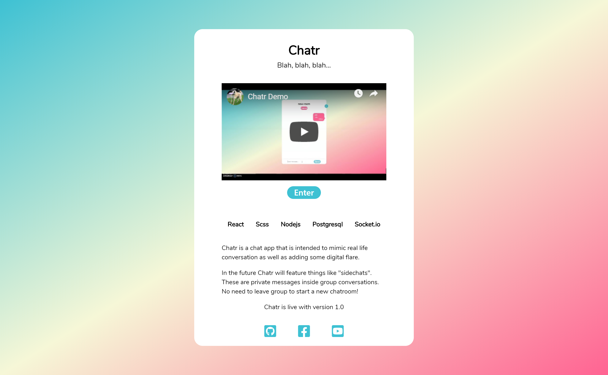
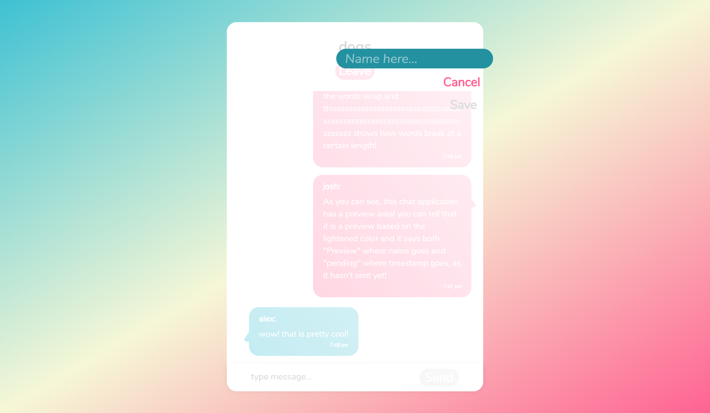
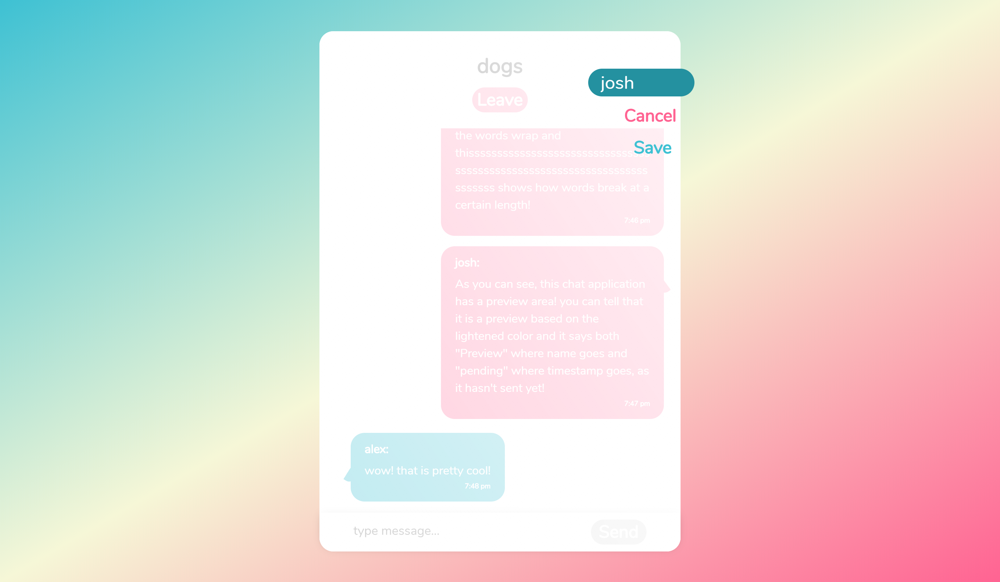
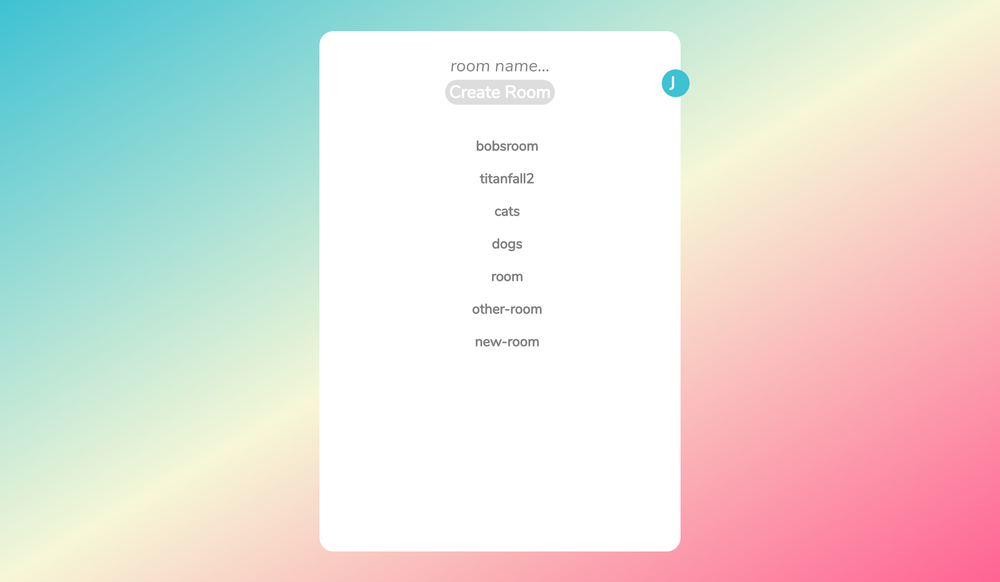
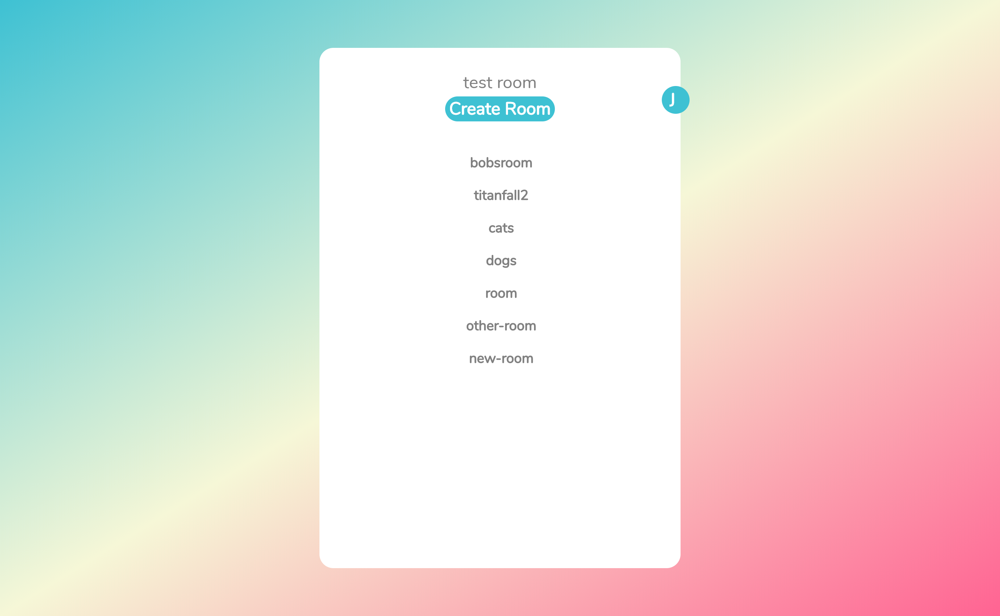
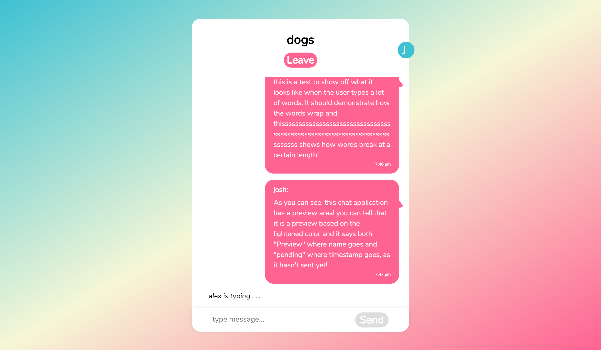
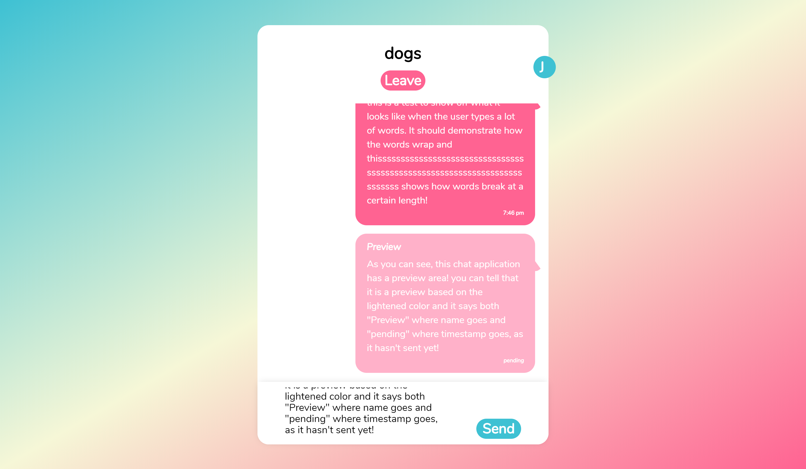
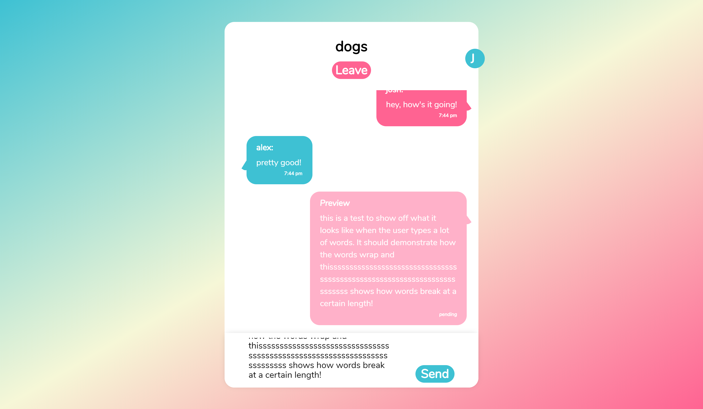

## Chatr

An easy to use chat app with clean animations and features

### Live link
Try it out: https://chat-client.joshrlear.now.sh/

### `To get things started locally`

git clone into your project folder. Make sure to git clone the server files as well: https://github.com/Joshrlear/chatr-server 
Run: "npm i" to update all depedencies
For client-side run: "npm start"

**To start just click enter, and type a name, no password needed.**
**Then either click on a room to join or create you own.**
**when chatting in the chatroom, your messages show on right, other users are on the left**
**while typing you can view a preview of your message and the other users will see "username" is typing...**
**changing username while inside the chatroom will leave the room. logout will leave room(if in room) and redirect to home page**

### `How it works`

- user enters name > check for user > create if doesn't exist)

- user enters new name while in chatroom > remove userRooms row that corresponds to user_id and rooms_id > create new userRooms row

- user enters room > add user to room > create new userRooms row

- user leaves room > remove user from room

- user creates room > user joins room > check rooms to see if room exists > if doesn't exist, room created in rooms table > check userRooms table if userRooms connection exists > if userRooms doesn't exist, create userRooms connection

- user types > show userTyping message to all but user that is typing

- user stops typing > shows username is typing for 3 seconds. after 3 seconds user typing message is removed

- user sends message > shows user message, username, and time received

### `Built with:`

- React
- scss
- video-react
- deployed to zeit
- testing: enzyme & jest

### `Features`

Chatr currently features real time messaging wtih the ability to 
change profile information from any screen accept the landing page.
Profile is accessible from most pages.

**Chatr does not require login and does not save messages. who you are**
**and what you say is your business.**

### `Future updates`

- ability to add images to profile.
- ability to send images in chat.
- the ability to create private "sidechats" inside of a group message without leavine room or current page.
To start a sidechat the sender starts a message by typing the recievers name
- switch between group chat and sidechat easily by clicking/tapping that chats icon.
- chat icons showing thumbnail of all user images to signify who is in which room
- easily see all users in chatroom with users profile thumbnail displayed at the top
of the chat.

## version

Live: v 1.0